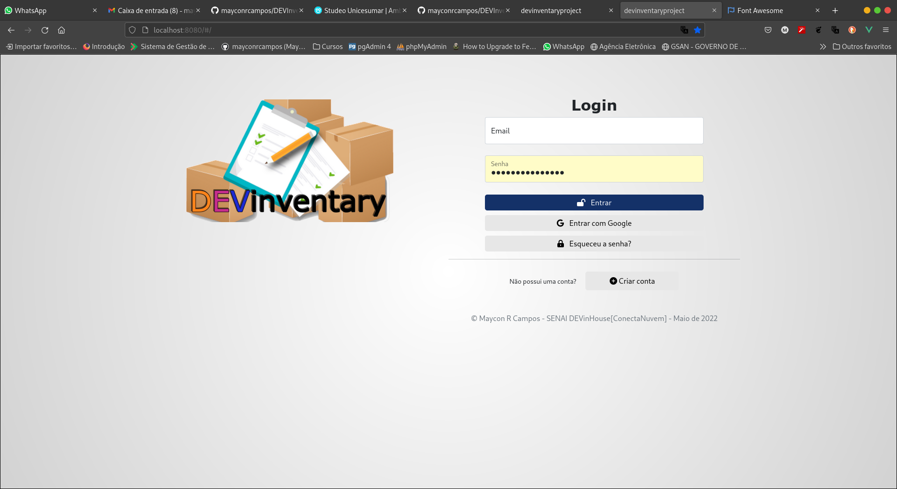

<h1>Projeto 02 - MÓDULO 01 - Senai DEVinHouse[ConectaNuvem]</h1>

<h2>Nome do Projeto: DEVInventary Project</h2>

Trata-se de um projeto onde devemos construir um sistema de Inventário e empréstimos de Itens para colaboradores de uma organização.

<strong>Professor: </strong>Gilmar Bennert

<strong>Curso: </strong>Senai DEVinHouse[ConectaNuvem]

<h3>Linguagens, tecnologias utilizadas:</h3>

<ul>
    <li>Javascript</li>
    <li>Framework - VueJS</li>
    <li>HTML + CSS3</li>
    <li>Bootstrap</li>
    <li>Versionamento com GIT</li>
</ul>

<h3>Conceitos abordados neste projeto: </h3>

<ul>
    <li>Consumo de API ViaCEP com Axios</li>
    <li>Utilização de Cookies para login</li>
    <li>Utilização de localStorage para persistência de dados</li>
    <li>Utilização de bibliotecas para ampliação das funcionalidades.</li>
</ul>

<h3>Bibliotecas, tecnologias utilizadas</h3>

<ul>
    <li>Vue-cli, NPM para criação do projeto e instalação dos pacotes e dependências.</li>
    <li>Vuex, para gerenciamento e centralização dos dados da aplicação.</li>
    <li>Axios, para consumir API ViaCEP para consulta do CEP em tempo real.</li>
    <li>Vue-Toaster, para gerar toasts de aviso que aparecem e somem na tela de forma automática.</li>
    <li>Vee-validate, para validação de todos os formulários da aplicação, protegendo a inserção indevida dentro dos arrays.</li>
    <li>Vue-Cookies, para guardarmos dados de usuário e persistir status logado do usuário e garantir seu acesso às rotas internas protegidas da aplicação.</li>
    <li>Vue-m-Dialog, para criação de modais bonitos que podem conter simples avisos, como tabelas e formulários.</li>
    <li>Vue-Router, para criação de todas as rotas da aplicação, bem como controle de acesso às mesmas através de guards.</li>
    <li>Vue-the-Mask, para criação de máscaras nos inputs para que o usuário digite sempre os dados no formato e tamanho desejados.</li>
    <li>Vue3-Gravatar, para criação de Avatars utilizando o email do usuário.</li>
</ul>

<h1>Telas do Sistema</h1>

<h2>Tela de login Login</h2>

<h2>Modal para criar conta</h2>

<h3>Modal esqueceu a senha</h3>

<h3>Modal entrar com Google</h3>

<h3>Tela inventário</h3>

<h3>Tela Cadastro de Colaboradores</h3>

<h3>Tela Listagem de colaboradores</h3>

<h3>Tela Cadastro de itens</h3>

<h3>Tela Empréstimo de Itens</h3>

<h3>Modal empréstimo de item</h3>

<h3>Modal Devolução de item</h3>

Tentei seguir da melhor forma e cumprir os requisitos da aplicação, mas teve algumas regras que eu tive de deduzir da melhor forma, que foram os casos abaixo.

<strong>Caso 1: Exclusão de item - </strong>Um item só pode ser excluído do sistema se ele não estiver emprestado naquele momento. O sistema não exclui itens emprestados.

<strong>Caso 2: Exclusão de colaborador - </strong>Um colaborador só pode ser excluído do sistema após ele tiver devolvido todos os itens que foram pegos emprestados por ele. 

<strong>Caso 3: Edição de item - </strong>Achei melhor deixar os campos principais do item readonly para que somente informações não essenciais pudessem ser alteradas. Caso algum item necessite trocar Código de patrimônio ou o próprio nome, melhor excluir e cadastrar outro.

<strong>Caso 4: Edição de colaborador - </strong>Seguindo a mesma linha, para edição de colaborador, os dados principais estão readonly, podendo somente alterar dados não essenciais, como telefone e endereço.
